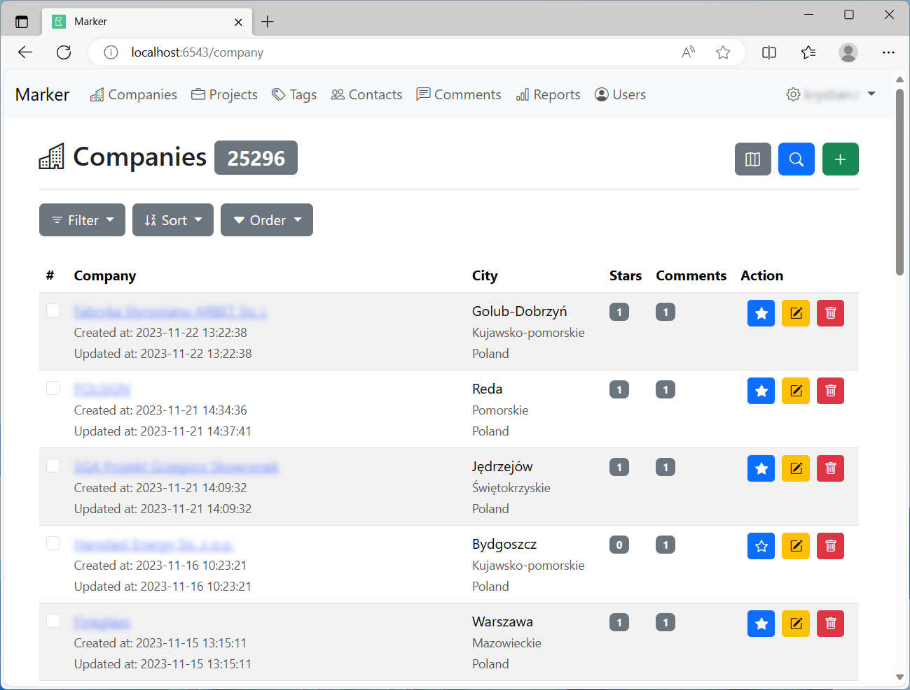
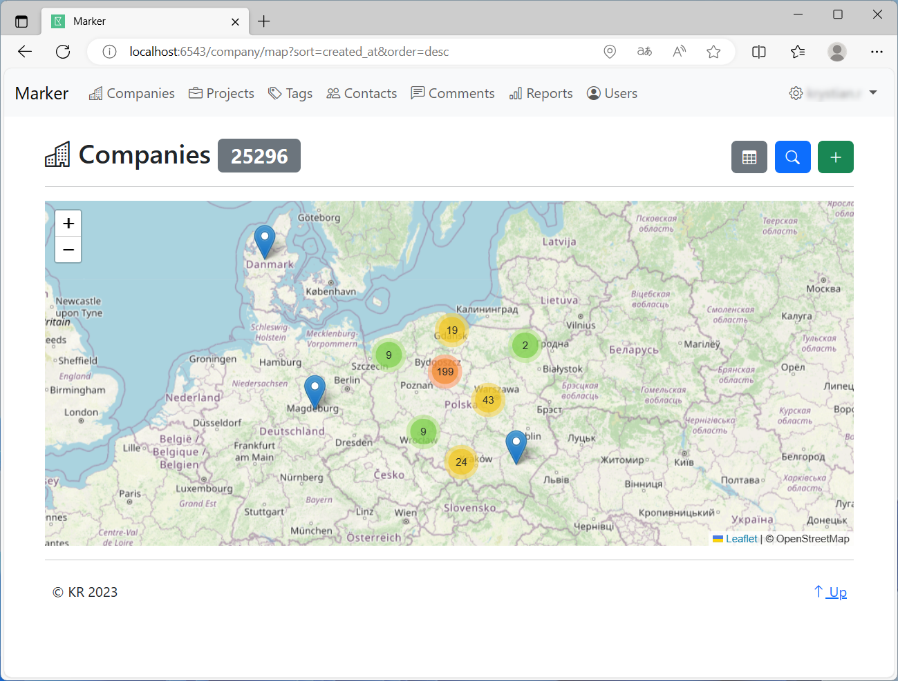

# Marker

Marker helps general contractors manage market relationships by unifying companies, projects, contacts, and activity data in one place for fast filtering, analysis, and reporting.

## Screenshots

## Model diagram

## Back-end

- Pyramid
- SQLAlchemy

## Front-end

- Bootstrap
- htmx
- Leaflet

## Website autofill

Legal-form detection used by website-based company name autofill is maintained in:

- `marker/utils/website_autofill.py`
- `_LEGAL_FORM_PATTERNS_BY_COUNTRY`

When adding new legal forms:

1. Add regex patterns to the relevant ISO country key (or create a new key).
2. Keep patterns tolerant for optional dots/spaces in abbreviations (for example `S.p.A.`).
3. Prefer folded/ASCII-safe forms in regex text where possible, because matching runs on normalized text (`_fold_text`).
4. Keep patterns specific enough to avoid generic word collisions.

Verification after updates:

- `python -m pytest tests/test_functional.py -k website_autofill`
- `python -m pytest`