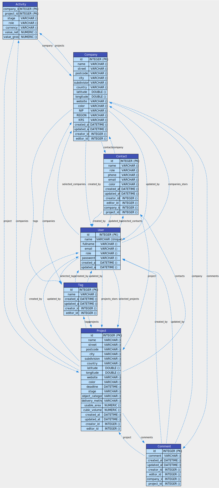

# Marker

Marker helps general contractors manage market relationships by unifying companies, projects, contacts, and activity data in one place for fast filtering, analysis, and reporting.

## Model diagram

## Back-end

- Pyramid
- SQLAlchemy

## Front-end

- Bootstrap
- htmx
- Leaflet
