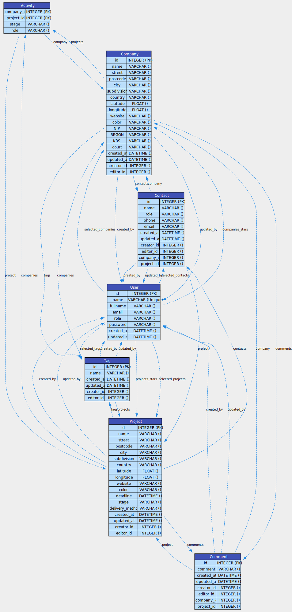

# Marker

App for General Contractors.

## Usage example

Find the most frequently recommended companies with a specific business profile and projects that meet the required criteria. Check which companies have implemented the largest number of projects, which subdivisions are the most entrepreneurial and in which industries there is the greatest competition.

## Screenshots

## Model diagram

## Back-end

- Pyramid
- SQLAlchemy

## Front-end

- Bootstrap
- htmx
- Leaflet